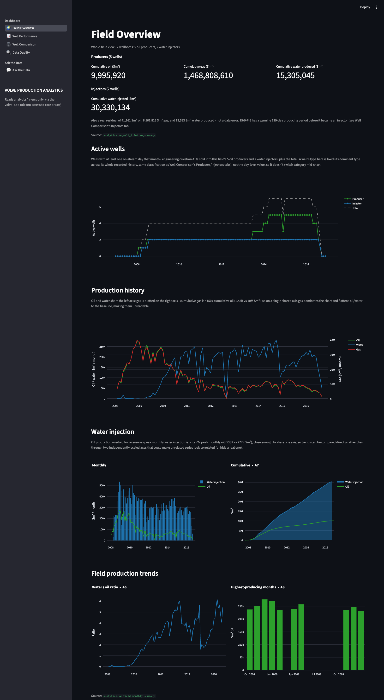
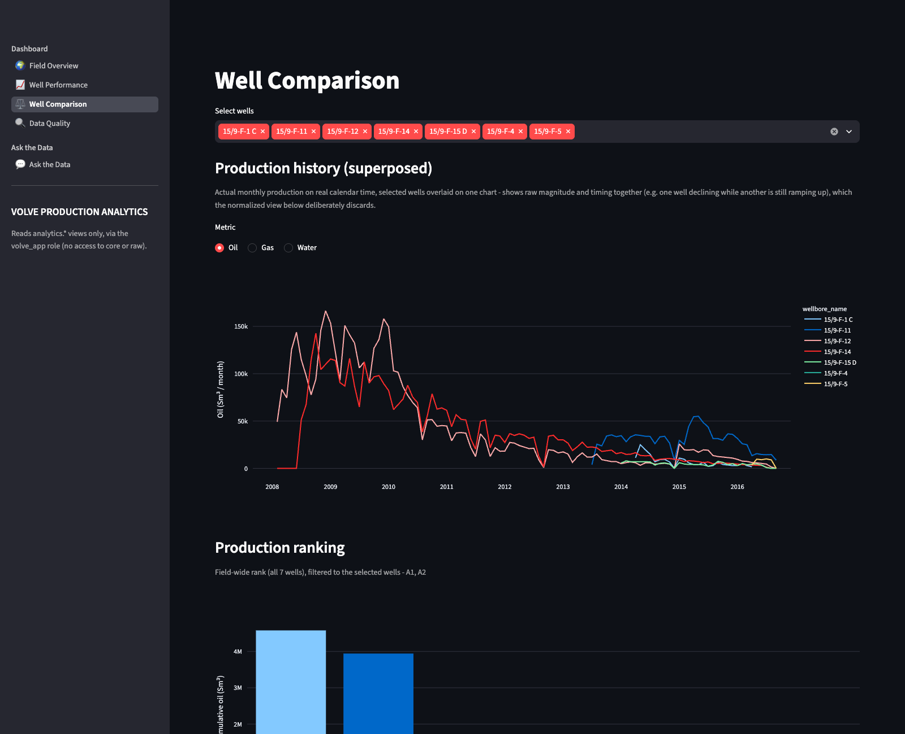
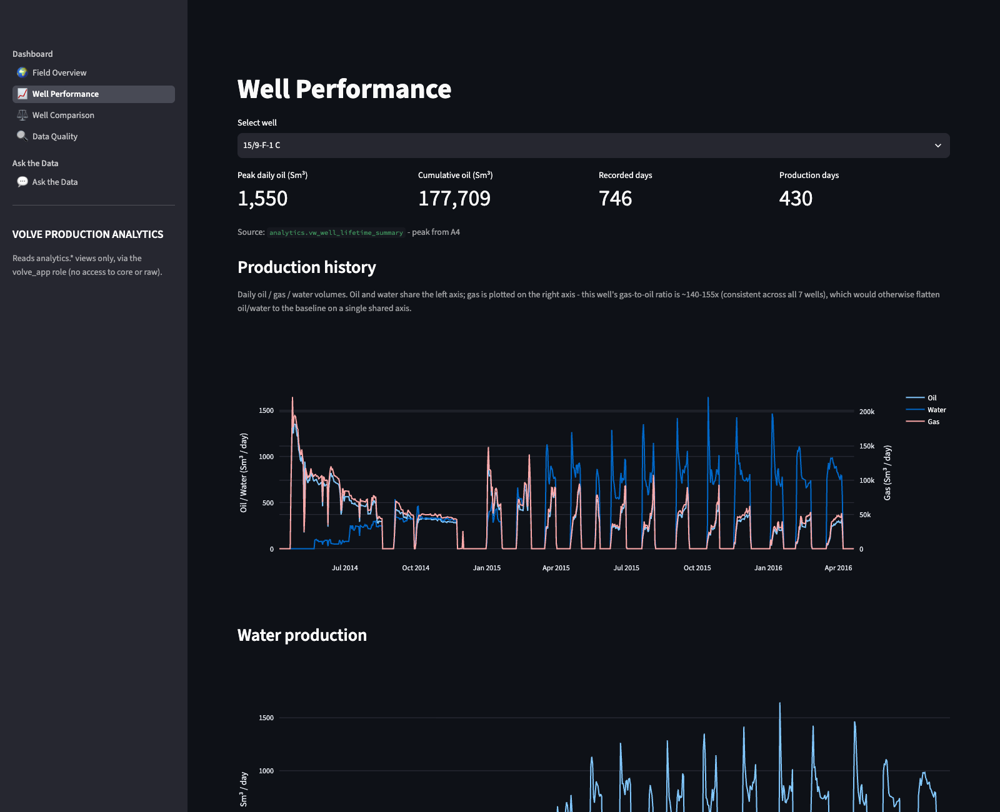
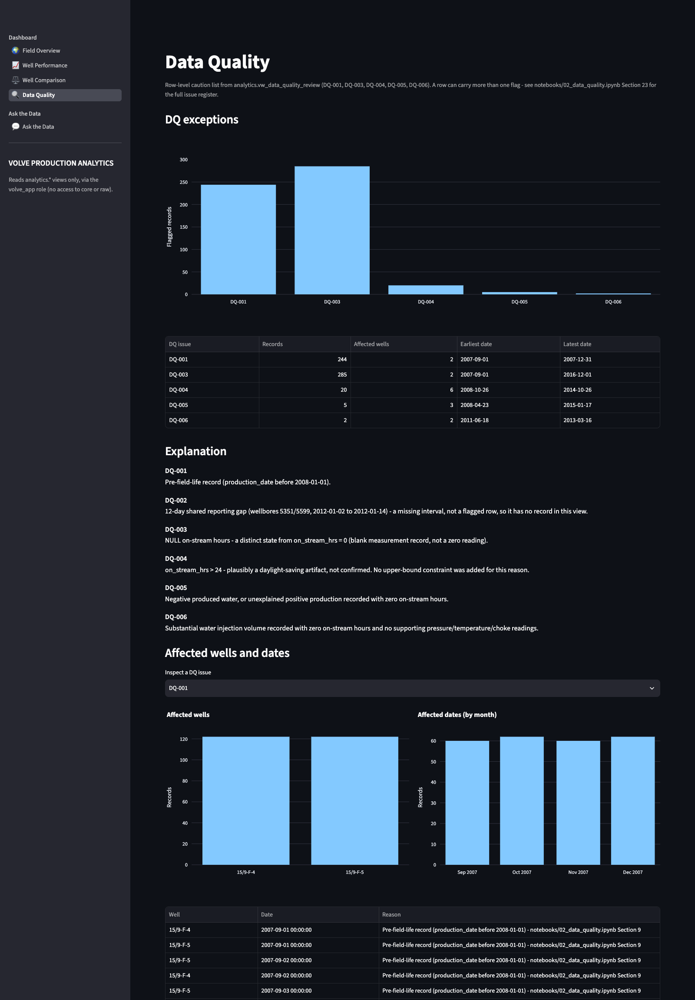
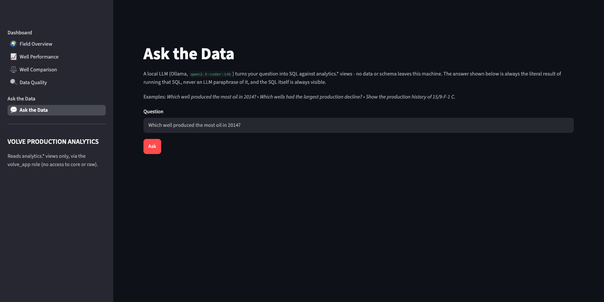
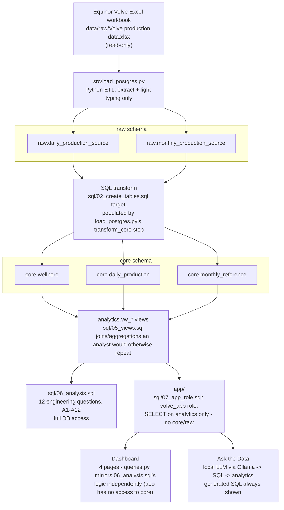

# Volve SQL


[](#data-license-and-attribution)
[](LICENSE)

A PostgreSQL-based production analytics project using Equinor's publicly
released Volve Data Village dataset, transforming raw well data into a
validated analytical database for investigating well performance, production
decline, water production, injection behaviour, uptime, and field evolution.

This is an independent project built for demonstration purposes. It is not
affiliated with, sponsored by, or endorsed by Equinor or the former Volve
license partners — see [Data license and attribution](#data-license-and-attribution)
and [`NOTICE`](NOTICE).

**Reviewing this project?** [`REVIEWER_GUIDE.md`](REVIEWER_GUIDE.md) is a
one-page fast path — what it demonstrates, how to run it in under 5 minutes
with no licensed data or local LLM required, and which files are worth your
time.

## Screenshots

The Streamlit dashboard (`app/`) — connected only to `analytics.*`, see
[Section 5](#5-architecture) — running against the live database.

**Field Overview**


**Well Comparison** — selected wells superposed on one chart, actual production on real calendar time


**Well Performance**


**Data Quality**


**Ask the Data** — free-text question → SQL via a local LLM, answer + source view + the generated SQL always shown


## 1. Project overview

This project takes a real oilfield production dataset — 15,634 daily records
and 527 monthly records across 7 wellbores on the Volve field (2008–2016) —
and turns it into a small, defensible PostgreSQL analytics database. The
emphasis throughout is on **evidence over assumption**: every schema
decision, every constraint, every index (or lack of one) is backed by a
profiling result, a quality check, or a query plan captured from the actual
data — not by what a production database "usually" looks like.

The project has two halves that build on each other:

1. **Data-quality assessment** (`notebooks/`) — understand the data before
   touching a database: grain, identifiers, missingness, plausible ranges,
   cross-sheet reconciliation, and a formal issue register (`DQ-001`–`DQ-006`).
2. **PostgreSQL implementation** (`sql/`, `src/`) — a `raw → core → analytics`
   schema architecture, a Python ETL loader, automated quality checks that
   re-verify the notebook's findings inside the database, analyst-facing
   views, and 12 engineering questions answered in SQL.

## 2. Business objective

Frame the dataset as an operator's engineering/reservoir team would use it:
track field and well-level oil, gas, and water production and injection over
time, identify decline trends and shutdown/restart events, and support the
kind of question a production engineer or data analyst actually asks —
"which wells are strongest," "when did the field peak," "how did water cut
evolve" — on top of a database that is honest about the data's real
limitations rather than one that has quietly discarded them.

## 3. Dataset

- **Source**: Volve Data Village release (Equinor), read from
  `data/raw/Volve production data.xlsx` and never modified. The file itself
  is not committed to this repository — see below and `data/README.md` for
  how to obtain it.
- **Daily sheet**: 15,634 rows, 7 wellbores, 2008-01-01 (nominal) through
  2016, one row per wellbore per calendar day with production/injection
  volumes and downhole/wellhead measurements.
- **Monthly sheet**: 527 rows, Equinor's own monthly rollup of the same
  wellbores — used as an independent reconciliation source, not as the
  primary fact table.
- Wellbores mix producers (`OP`) and injectors (`WI`), and several wellbores
  change role over their recorded lifetime (see [Section 11](#11-database-design-decisions)).

### Data license and attribution

This project uses data from the Volve Data Village, made available by
Equinor and the former Volve license partners, ExxonMobil Exploration &
Production Norway AS and Bayerngas Norge AS (or their successors/assignees).

The Volve dataset is used under the
[Volve Data Village Terms and Conditions for Use of License to Data](https://cdn.equinor.com/files/h61q9gi9/global/de6532f6134b9a953f6c41bac47a0c055a3712d3.pdf?equinor-hrs-terms-and-conditions-for-licence-to-data-volve.pdf=)
(see also [Equinor's Volve data-sharing page](https://www.equinor.com/energy/volve-data-sharing)).
The original dataset remains subject to those terms.

This repository is an independent project and is not affiliated with,
sponsored by, or endorsed by Equinor or the former Volve license partners.

The source workbook is deliberately **not** committed to this repository
(`data/raw/*.xlsx` is gitignored) — both to avoid redistributing the
licensed material itself, and because a database built from a substantial
portion of it would constitute Adapted Material under the license's terms.
See `NOTICE` and `data/README.md` for how to obtain the file and verify it
against the checksum this project was built and tested against.

Equinor provides the dataset "as is," with no warranty concerning accuracy,
quality, or fitness for purpose, and states it may contain errors or
omissions. That is precisely the starting assumption
[Section 7](#7-data-quality-approach) is built on — nothing in this project
treats the source as authoritative by default; every questionable value was
investigated and documented (`DQ-001`–`DQ-006`) rather than silently
corrected or discarded.

## 4. Why PostgreSQL

The dataset is small enough to fit in memory, but the questions it raises —
composite natural keys vs. surrogate IDs, NULL vs. zero semantics, exact
decimal precision for volumes, window functions for time-series ranking and
rolling calculations, evidence-based indexing — are exactly the questions a
relational, ACID-compliant SQL engine is built to answer well. PostgreSQL's
`NUMERIC` type, rich window-function support, and `EXPLAIN (ANALYZE,
BUFFERS)` tooling made the quality-check and indexing phases possible to do
properly rather than by guesswork.

## 5. Architecture



`sql/06_analysis.sql` and `app/` are parallel, independent consumers of
`analytics.*` - not a sequential pipeline. `app/queries.py` re-derives the
same engineering logic (A1-A12) against the analytics views on its own,
because `app/`'s database role has no grant on `core` at all and so
literally cannot depend on the SQL walkthrough's queries even if it wanted
to; see `app/README.md`'s note on this. Both paths sitting side by side is
itself evidence the `analytics` layer carries enough information for real
analysis, not just for the SQL demonstration.

`raw` preserves the source as faithfully as typing allows; `core` is where
this project's validated rules (grain, keys, constraints) actually live;
`analytics` is derived and disposable — every view in it can be dropped and
rebuilt from `core` alone. There is deliberately no `staging` layer: the
dataset is small and clean enough at the row level that `raw → core` is a
single, auditable transform, not a multi-pass pipeline.

The progression through the project also tracks a **strongest part**
gradient — each phase is more defensible than the last because it stands on
the verified output of the one before it:

```
   profiling  ->  data-quality notebook  ->  core schema + constraints  ->  quality checks  ->  views  ->  analysis
   (weakest:                                                                                              (strongest:
    describes                                                                                              every number
    the data)                                                                                               traceable to
                                                                                                              a tested rule)
```

## 6. Data model

```
 core.wellbore
 -------------                 1        N
 npd_well_bore_code (PK) ------------------- core.daily_production
 npd_well_bore_name (UQ)                     ----------------------
 well_bore_code (UQ)                         npd_well_bore_code (PK, FK)
                                              production_date    (PK)
                                              well_type / flow_kind (temporal, not static)
                                              on_stream_hrs, bore_oil_vol, bore_gas_vol,
                                              bore_wat_vol, bore_wi_vol, avg_downhole_pressure,
                                              avg_downhole_temperature, avg_dp_tubing,
                                              avg_annulus_press, avg_choke_size_p, avg_whp_p,
                                              avg_wht_p, dp_choke_size, ...
                    |
                    | 1        N
                    +---------------------- core.monthly_reference
                                             ----------------------
                                             npd_well_bore_code (PK, FK)
                                             reference_year     (PK)
                                             reference_month    (PK)
                                             on_stream, oil, gas, water, gi, wi  (TEXT - see Section 11)

 analytics.* are VIEWS, not tables - derived from core, not persisted:
   vw_daily_well_performance     - core.daily_production JOIN core.wellbore
   vw_monthly_well_performance   - core.daily_production aggregated to month (independent of monthly_reference)
   vw_well_lifetime_summary      - one row per wellbore
   vw_field_monthly_summary      - one row per calendar month, field-wide
   vw_data_quality_review        - row-level DQ-001/003/004/005/006 caution list
```

`core.daily_production`'s primary key is the composite natural key
`(npd_well_bore_code, production_date)` — deliberately not a surrogate
integer ID, because the natural key was tested (not assumed) to be unique
and non-null across all 15,634 rows before being adopted.

## 7. Data-quality approach

Before any PostgreSQL object existed, `notebooks/02_data_quality.ipynb`
worked through 27 sections of profiling and testing against the raw
workbook: dataset and monthly grain, identifier integrity (within-sheet and
cross-sheet), temporal validity, on-stream-hours behavior, missingness,
categorical domains, plausible ranges for every measurement family
(production, injection, pressure, temperature, choke), cross-variable
consistency, duplicates, outliers, and a full daily-vs-monthly
reconciliation. This produced a formal issue register:

| ID | Issue |
|---|---|
| DQ-001 | 244 pre-field-life records (`production_date` before 2008-01-01) |
| DQ-002 | A 12-day shared reporting gap (wellbores 5351/5599, 2012-01-02–01-14) |
| DQ-003 | 285 rows with NULL `on_stream_hrs` — a distinct state from `on_stream_hrs = 0` |
| DQ-004 | 20 rows with `on_stream_hrs > 24` — plausibly a daylight-saving artifact, not confirmed |
| DQ-005 | 5 rows: negative produced water, or unexplained positive production at zero hours |
| DQ-006 | 2 rows: substantial water injection recorded at zero on-stream hours with no supporting pressure/temperature/choke readings |

None of these were "fixed" by deleting or silently correcting rows. The
dataset is not described as "clean" anywhere in this project — it is
described as **understood**, with every known exception carried forward as
an explicit, queryable flag (`analytics.vw_data_quality_review`) rather than
hidden.

## 8. SQL implementation

| File | Purpose |
|---|---|
| `sql/01_create_schemas.sql` | Creates `raw`, `core`, `analytics` |
| `sql/02_create_tables.sql` | 5 tables: 2 raw mirrors, `core.wellbore`, `core.daily_production`, `core.monthly_reference`, with PKs/FKs/CHECK constraints derived from Section 7's findings |
| `sql/03_create_indexes.sql` | Deliberate no-op — see [Section 11](#11-database-design-decisions) |
| `src/load_postgres.py` | Python ETL: loads `raw` from the workbook, then SQL-transforms `raw → core` inside a single transaction (truncate-and-reload, idempotent) |
| `sql/04_quality_checks.sql` | 27 automated checks (`QC-001`–`QC-021`, `DQ-001`–`DQ-006`), each PASS/FAIL/REVIEW, re-verifying the notebook's findings against the live database |
| `sql/05_views.sql` | 5 analyst-facing views — deliberately not a "KPI factory"; no derived business ratios until an analysis question needs one more than once |
| `sql/06_analysis.sql` | 12 engineering questions, A1–A12 |
| `sql/07_app_role.sql` | Creates `volve_app`, a least-privilege role with `SELECT` on `analytics` only, for `app/` |
| `app/` | Streamlit dashboard + "Ask the Data" NL-to-SQL page, both built directly on `analytics.*` and the A1–A12 questions — see `app/README.md` |

Every measurement column uses `NUMERIC`, not `FLOAT`/`DOUBLE PRECISION` — it
prevents new arithmetic rounding error, though it can't erase precision
differences already present between two independently-computed
source values (see `QC-016` below).

## 9. Engineering questions and 10. Key findings

Each question is answered directly in `sql/06_analysis.sql`, built on the
`analytics` views. Figures below are live output from `volve_analytics`.

**A1 — Which wellbores produced the most cumulative oil?**
*SQL:* `RANK() OVER (ORDER BY total_oil DESC NULLS LAST)` on
`vw_well_lifetime_summary`.
*Finding:* 15/9-F-12 leads at 4,579,609.55 Sm³, ahead of 15/9-F-14
(3,942,233.39) and 15/9-F-11 (1,147,849.10). 15/9-F-4 is a pure injector —
`total_oil` is NULL, not zero.
*Interpretation:* `NULLS LAST` is not cosmetic — PostgreSQL's default
`DESC` order sorts NULL first, which silently ranked the injector #1 during
development until caught on reproducibility review. NULL and zero are
different claims (never produced, vs. produced nothing) and the ranking
logic has to respect that distinction explicitly.

**A2 — Which wellbores produced the most gas / water?**
*SQL:* `RANK()`/`DENSE_RANK() ... NULLS LAST`, same view.
*Finding:* Gas leader is 15/9-F-12 (667,542,278.02); water leader is
15/9-F-14 (7,121,249.74) — not the same wellbore that leads oil, showing gas
and water behave differently across the field's wells.

**A3 — When did each wellbore first produce?**
*SQL:* `MIN(production_date) WHERE bore_oil_vol > 0`, grouped per wellbore.
*Finding:* Wellbores entered production in staggered waves rather than all
at field startup — consistent with the field's actual phased development.
*Interpretation:* using `bore_oil_vol > 0` rather than the row's first
recorded date matters — a wellbore's earliest row is often a DQ-001/DQ-003
blank-state record, not its first barrel.

**A4 — What was each wellbore's peak daily oil rate, and when?**
*SQL:* `MAX(bore_oil_vol)` per wellbore, joined back to its date via a
window function.
*Finding:* Peak daily rates vary by more than an order of magnitude across
wellbores, and peak dates cluster in each well's early producing life —
consistent with typical reservoir decline behavior.

**A5 — How did each wellbore's production compare with its own peak at
30/90/365 days after peak?**
*SQL:* `ROW_NUMBER() OVER (PARTITION BY npd_well_bore_code ORDER BY
bore_oil_vol DESC)` to find each well's peak day, then `LEFT JOIN` back to
the exact calendar dates `peak_date + 30/90/365`.
*Finding:* The gap at the +90-day checkpoint is wide — from 12.8% below
peak (15/9-F-12) to 70.0% below peak (15/9-F-1 C) — with no single pattern
across wells.
*Interpretation:* This is a point-in-time comparison to each well's own
peak day, not decline-curve analysis — checkpoints use an exact
calendar-date match, not a smoothed trend, so a single shutdown landing
exactly on a checkpoint can read as a large change unrelated to reservoir
performance. `app/`'s Well Comparison page pairs this with the normalized
production profile (the fuller trajectory) so a surprising checkpoint value
can be checked in context rather than taken at face value.

**A6 — How did field-wide water-oil ratio trend over time?**
*SQL:* `SUM(water)/NULLIF(SUM(oil),0)` on `vw_field_monthly_summary`,
ordered by `month_start`.
*Finding:* Water cut rises through the field's life, the expected signature
of natural water breakthrough/injection support as a waterflood field
matures.

**A7 — How did cumulative water injection trend?**
*SQL:* `SUM() OVER (ORDER BY month_start)` running total on
`vw_field_monthly_summary`.
*Finding:* Injection volume grows through the field's operating life as
more injector wellbores come online and injection intensifies to support
pressure maintenance.

**A8 — What were the field's highest-producing months?**
*SQL:* `RANK() OVER (ORDER BY oil_volume DESC)` on
`vw_field_monthly_summary`.
*Finding:* The top 10 months are all Oct 2008–Jan 2010, led by December
2008 at 276,638.95 Sm³ — the field's early peak, before later decline and
water cut growth take hold.

**A9 — What share of field oil did each wellbore contribute, per year?**
*SQL:* `SUM(oil) OVER (PARTITION BY year)` window total, divided into each
wellbore's yearly sum; verified to sum to exactly 100.0% per year.
*Finding:* Contribution mix shifts materially year over year as wells
mature and new ones start up — no single wellbore dominates every year.

**A10 — How many wells were actively producing/injecting through time?**
*SQL:* `count(DISTINCT npd_well_bore_code) FILTER (WHERE on_stream_hrs > 0)`
per month, on `vw_field_monthly_summary`.
*Finding:* Active well count ramps from 0 up to 7 as the field is developed,
and eventually back toward 0 — a clean visual of the field's full lifecycle
in one series.

**A11 — How often did wells shut down and restart?**
*SQL:* `LAG(is_active) OVER (PARTITION BY npd_well_bore_code ORDER BY
production_date)` compared with `CASE WHEN ... THEN 'shutdown'/'restart'
END`.
*Finding:* Transition counts vary widely by wellbore; 15/9-F-4 has the most
at 124 shutdown/restart events over its recorded life.
*Interpretation:* a high transition count is a legitimate operational
signature (frequent well intervention/testing on an injector), not a data
quality problem — worth distinguishing from the DQ register's genuine
exceptions.
*Extended:* `sql/06_analysis.sql` also reconstructs full downtime episodes
from these transitions ("gaps and islands" — `LAG()` + a running `SUM()`
groups consecutive same-state days into one episode), with offline duration
and oil production immediately before/after each shutdown. Surfaced on the
dashboard's Well Performance page.

**A12 — Does a new well coming online affect field oil rate?**
*SQL:* before/after average `bore_oil_vol` window around each wellbore's
first-production date, joined against `vw_field_monthly_summary`.
*Finding:* Field oil rate rises measurably after new wellbores start up —
e.g. around 15/9-F-4's 2008-04 entry, field average moves from roughly
66,226 to roughly 145,182 Sm³/day before vs. after.
*Interpretation:* a directional, not strictly causal, read — other wells'
own trajectories move over the same window — but the direction is
consistent with what bringing a new producer online should do.

### What the data-quality phase changed

The notebook phase wasn't a formality before the "real" database work — it
changed concrete schema decisions:

- **`well_type`/`flow_kind` are per-row columns on `core.daily_production`,
  not a static attribute of `core.wellbore`** — because several wellbores
  genuinely change role (producer ↔ injector) over their recorded history.
  A wellbore-level column would have been factually wrong for those rows.
- **`(npd_well_bore_code, production_date)` was tested, not assumed, as the
  primary key** — uniqueness and non-null coverage were verified across all
  15,634 rows in the notebook before `sql/02_create_tables.sql` relied on it.
- **NULL `on_stream_hrs` is a distinct, preserved state, not coerced to
  zero** — DQ-003 documents 285 rows where "no reading" and "reading of
  zero" mean different things operationally, and collapsing them would have
  destroyed that distinction.
- **The 20 rows with `on_stream_hrs > 24` (DQ-004) are documented and kept,
  not deleted** — a `CHECK (on_stream_hrs >= 0)` constraint exists, but
  deliberately has no upper bound, because the cause (plausibly
  daylight-saving) isn't confirmed and there is no principled cutoff to
  reject data on.

## 11. Database design decisions

- **Composite natural keys over surrogate IDs.** `core.daily_production`'s
  PK is `(npd_well_bore_code, production_date)`; `core.monthly_reference`'s
  is `(npd_well_bore_code, reference_year, reference_month)`. No
  auto-generated `production_id` was introduced — the natural grain was
  already provably unique.
- **`raw.monthly_production_source`'s measurement columns are `TEXT`, not
  numeric**, because the source sheet has stray non-numeric contamination in
  those columns — preserving the raw type avoids silently coercing or
  dropping malformed source values before they can be inspected.
- **CHECK constraints only where the data showed zero observed
  violations.** Most measurement columns have a non-negativity check;
  `bore_wat_vol` deliberately does not, because DQ-005 found real negative
  values in the source and a blanket constraint would have rejected genuine
  (if unexplained) data on load.
- **Indexing decision.** `sql/03_create_indexes.sql` adds **zero** indexes
  beyond what PostgreSQL creates automatically for primary/unique keys. This
  was tested, not assumed: every query in `sql/06_analysis.sql` either joins
  on `npd_well_bore_code` (already the leading column of
  `pk_daily_production`), windows `PARTITION BY npd_well_bore_code ORDER BY
  production_date` (matching that same key's column order exactly), or
  aggregates by an *expression* of `production_date`
  (`EXTRACT(YEAR/MONTH FROM ...)`), which a plain B-tree index on the raw
  column cannot accelerate. `EXPLAIN (ANALYZE, BUFFERS)` confirmed identical
  query plans with and without a candidate `production_date` index for the
  queries this project actually runs, even though the same index measurably
  helps a plain chronological scan — a query shape not present in
  `06_analysis.sql` today. Adding the index anyway would have weakened the
  project's own evidence-based logic; the file documents the tested-and-
  rejected candidates rather than pretending the question wasn't asked.
- **`analytics.vw_monthly_well_performance` is computed independently from
  `core.daily_production`**, not derived from `core.monthly_reference` —
  so the two remain comparable (and are, via `QC-014`/`015`/`016`) instead
  of collapsing into the same thing.
- **`analytics.vw_data_quality_review` allows multiple rows per
  `(npd_well_bore_code, production_date)`.** DQ-001 and DQ-003 overlap on
  244 of 285 rows; the view does not deduplicate, so an analyst querying it
  can legitimately see more than one flag per record.

## 12. Reproducibility

Shortcut: `make setup && make load && make check && make app` runs the same
sequence below via four Makefile targets (`make help` lists all of them,
including `make load-fixture` - loads a tiny synthetic stand-in instead of
the real workbook, so `make check`/`make app` have something to show
without the licensed data). No local PostgreSQL install? `make docker-up`
runs PostgreSQL 17 in Docker instead (`docker-compose.yml`) - export
`PGHOST=localhost PGUSER=postgres` first, then every target above works
unchanged. The manual sequence:

```bash
python -m venv .venv && source .venv/bin/activate
pip install -r requirements.txt

# Obtain the Volve source workbook yourself and place it at
# data/raw/Volve production data.xlsx - see data/README.md.
# It is not included in this repository (Volve Data Village license terms).

createdb volve_analytics   # or point to an existing empty database

psql -d volve_analytics -f sql/01_create_schemas.sql
psql -d volve_analytics -f sql/02_create_tables.sql
python src/load_postgres.py
psql -d volve_analytics -f sql/04_quality_checks.sql   # expect: 21 PASS, 6 REVIEW, 0 FAIL
psql -d volve_analytics -f sql/05_views.sql
psql -d volve_analytics -f sql/06_analysis.sql
psql -d volve_analytics -f sql/03_create_indexes.sql   # documentation + verification query only
psql -d volve_analytics -f sql/07_app_role.sql
streamlit run app/app.py   # http://localhost:8501 - see app/README.md
```

`src/load_postgres.py` truncates and reloads inside a single transaction, so
re-running any step is safe. `sql/04_quality_checks.sql` is the fastest way
to confirm the database matches this README: it should report `27` total
checks, `21` PASS, `6` REVIEW, `0` FAIL, `PASS WITH REVIEW` overall.

## 13. Repository structure

```
Volve_SQL/
├── README.md
├── REVIEWER_GUIDE.md            one-page fast path for reviewers
├── LICENSE                      MIT license - covers this project's code only
├── NOTICE                       Volve data attribution and license notice
├── Makefile                     make setup/load/load-fixture/check/app
├── docker-compose.yml           PostgreSQL 17, if you don't have it installed locally
├── requirements.txt
├── .github/workflows/
│   └── ci.yml                   lint + schema dry-run + fixture load + pytest, on every push
├── data/
│   ├── README.md                how to obtain the source workbook
│   ├── raw/                     Volve production data.xlsx (gitignored - not committed)
│   └── profiling/               CSV outputs from src/profile_source.py
├── notebooks/
│   ├── 01_source_exploration.ipynb
│   └── 02_data_quality.ipynb
├── src/
│   ├── profile_source.py
│   └── load_postgres.py
├── sql/
│   ├── 01_create_schemas.sql
│   ├── 02_create_tables.sql
│   ├── 03_create_indexes.sql
│   ├── 04_quality_checks.sql
│   ├── 05_views.sql
│   ├── 06_analysis.sql
│   └── 07_app_role.sql
├── tests/                       pytest suite (76 tests) - see tests/conftest.py
│   ├── conftest.py
│   ├── fixtures/generate_sample_workbook.py   tiny synthetic 2-well workbook
│   ├── test_load_postgres.py
│   ├── test_nlsql.py
│   └── test_queries.py
├── docs/
│   └── screenshots/               dashboard screenshots used in this README
└── app/                          Streamlit dashboard + Ask the Data - see app/README.md
    ├── app.py
    ├── db.py
    ├── queries.py
    ├── nlsql.py                  Ask the Data: question -> SQL, via local Ollama
    ├── bench_nlsql.py            model benchmark (evidence for nlsql.py's default model)
    ├── bench_results.md
    └── views/
        ├── field_overview.py
        ├── well_performance.py
        ├── well_comparison.py
        ├── data_quality.py
        └── ask_the_data.py
```

## 14. Technologies

PostgreSQL 17 · Python 3.11 · pandas · openpyxl · psycopg2 · Jupyter
(nbformat/nbclient) · Streamlit · Plotly · plain SQL (no ORM)

## 15. Limitations

- Single source workbook, one field, 7 wellbores — patterns here are not
  claimed to generalize to other fields or operators.
- DQ-002, DQ-004, and DQ-005's root causes (a shared reporting gap, possible
  daylight-saving artifacts, and unexplained negative/zero-hours readings)
  are documented and preserved, not resolved — there was no independent
  source to confirm a root cause against.
- A12's "before/after" read on new-well startup is directional, not a
  controlled causal estimate — other wellbores' trajectories move over the
  same window.
- No orchestration/scheduling layer — this is a one-shot batch pipeline, not
  a production ingestion system.

## 16. Future work

- Automate `src/profile_source.py`'s remaining structure-only notebook
  sections (1–3) if the project is extended to a new source file.
- Revisit `sql/03_create_indexes.sql` if `06_analysis.sql` grows to include
  a plain chronological scan or a `production_date` range filter — the
  supporting `EXPLAIN` evidence already exists in that file.
- Extend `analytics` with true KPI views (water cut, GOR, decline curves)
  once those calculations are used by more than one downstream consumer,
  per the "no KPI factory" rule in `sql/05_views.sql`.
- Improve "Ask the Data" on the two failure modes `app/bench_results.md`
  found in every model tested: distinguishing a wellbore's first *recorded*
  row from its first *producing* row, and generating a correct
  `LAG`/`CASE` shutdown-restart query reliably.
- Distinguish production loss from operational downtime on the "Production
  change from peak" chart (Well Comparison): if a checkpoint's `on_stream_hrs`
  is also well below the well's peak-day hours, surface that alongside the
  percentage (e.g. "54% below peak at +30 days - operating hours were also
  reduced") - the daily grain already has oil, gas, water, choke, pressure,
  and temperature alongside on-stream hours, so this is a real signal, not
  new data collection. Needs a defined threshold for "reduced hours" and a
  decision on where it's surfaced (tooltip vs. table column) before building.
